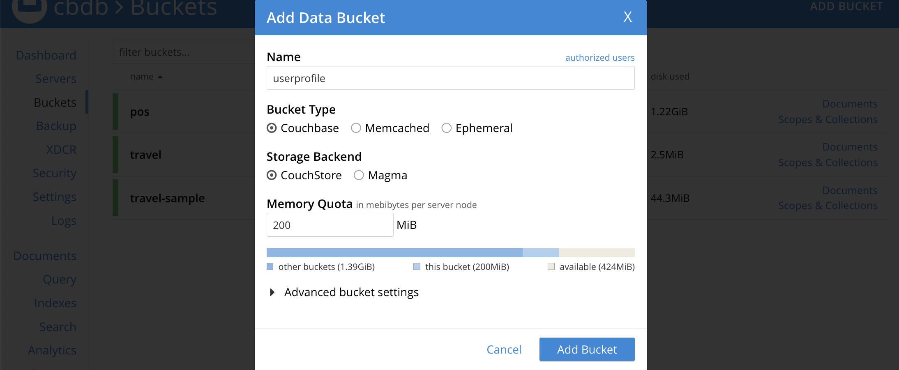
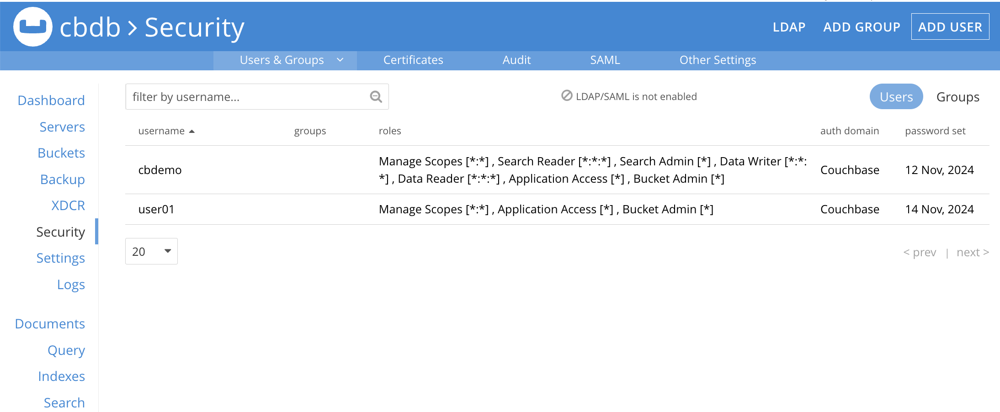

이 애플리케이션은 https://github.com/couchbaselabs/userprofile-couchbase-mobile 에서 가져와서 수정한 것입니다. <br>

<br>**이 소스는 카우치베이스 DB, Sync Gatewat, Couchbase Lite가 어떻게 동작하는지는 보여 주는 데모입니다.** <br>

아래에 설명된 내용은 **MacOS** 환경에서 구현한 내용입니다. Windows나 Linux환경에서 테스트시에는 OS에 종속된 부분은 수정/보완하여 테스트 하십시오. <br>
1) Couchbase Server 설치 및 구성, <br>
2) Sync Gateway 패키치를 설치하여 구성, <br>
3) IOS용 클라이언트 앱을 구성.실행하는 방법을 설명합니다. <br>
<br>

## 1. Couchbase Server 설치 및 구성.<br>
1-1. MacOS용 카우치베이스 패키지 다운로드 및 설치 구성. <br>
- MacBook의 메모리가 최소 8GB, 권장 16GB 이상입니다. <br>
- 아래 링크에 카우치베이스 설치방법이 설명되어 있습니다. <br>
   https://receptive-blender-fda.notion.site/Couchbase-Install-on-MacOS-1342845c3696806387fdc02b67e2a7c9 <br>
- Couchbase 기본 관리 계정 : `Administrator / password`  <br>

1-2. 본 데모를 위한 Bucket 생성 : `userprofile` <br>
- 좌측 메뉴에서 **Bucket** 선택 > 우측 상단에서 **ADD BUCKET** 선택 <br>


- **Name**에 `userprofile` 입력, **Memory Quota**에 `200`MB 입력 후 , **Add Bucket** 실행.<br>

 

1-3. Sync Gateway 접속 계정 생성 : `admin / password`  <br>
- 좌측 메뉴에서 **Security** 선택 > 우측 상단에서 **ADD USER** 선택 <br>


- **Username**에 `admin` 입력, **Password**에 `password`, **Verify Password**에 `password` 입력 후 ,<br>
  우측 **Roles** 에서 **Mobile** 선택 > **Sync Gateway** 선택 후 bucket 을 `*` 선택, <br>
  우측 하단에 **Add User** 선택.


## 2. IOS Client/SDK 소스 크론 및 구성 <br>
2-1. gitbub에서 다운로드 및 구성.

```
cd ~/Workplace
git clone https://github.com/unixfree/userprofiledemo.git
cd userprofiledemo
./install_tutorial.sh 3.2.1   -> check "Frameworks" Folder in current Directory.
```

## 3. Sync Gateway 설치 및 구성 <br>
3-1. Install Sync Gateway<br>
3-1-1. https://www.couchbase.com/downloads 에서 "Mobile & Edge" > Sync Gateway(Enterprise) 에서 다운로드 수행. <br>
<br>
or<br>
```
wget https://packages.couchbase.com/releases/couchbase-sync-gateway/3.2.0/couchbase-sync-gateway-enterprise_3.2.0_arm64.zip?_gl=1*1das0cc*_gcl_au*MTA4ODgyNzUyMC4xNzI3MDQ4NjMx
```
<br>
3-1-2. Sync Gateway 설치 
다운로드 파일(couchbase-sync-gateway-enterprise_3.2.0-461_arm64.zip)을 /opt 로 옮긴 후, 압출 풀기 수행. <br>

```
sudo mv couchbase-sync-gateway-enterprise_3.2.0-461_arm64.zip /opt
cd /opt
sudo unzip couchbase-sync-gateway-enterprise_3.2.0-461_arm64.zip
sudo rm couchbase-sync-gateway-enterprise_3.2.0-461_arm64.zip
sudo ls /opt/couchbase-sync-gateway 
```

3-2. Sync Gateway 구성 파일 생성 <br>
구성 설정 파일(sync-gateway-config.json)의 내용 중, `server connection`, `id/password` 수정  <br>

```
cd ~/Workplace/userprofiledemo
vi sync-gateway-config.json
```
 
<br>
3-3. Sync-gateway 구동  <br>

```
/opt/couchbase-sync-gateway/bin/sync_gateway ~/Workplace/userprofiledemo/sync-gateway-config.json.json <br>
```

## 4. IOS Client/SDK 빌드 및 실행. <br>
<br>
4-1. Xcode에서 Project 오픈, Build, Run <br>
open UserProfileSyncDemo.xcodeproj at Xcode. <br>

Build.<br>

4-2. 소스 설명. <br>

## 참고 URL <br>
 아래 A만 우선 참고하시면 됩니다. <br>
<br>
A) 기본 사용법 설명 ( Server + Sync Gateway + Couchbase Lite ) <br>
https://docs.couchbase.com/tutorials/userprofile-sync/userprofile_sync.html <br>
B) 기본 사용법 설명 ( Couchbase Lite Only) <br>
https://docs.couchbase.com/tutorials/userprofile-standalone/userprofile_basic.html <br>
C) 소스(GitHub) <br>
https://github.com/couchbaselabs/userprofile-couchbase-mobile <br>
D) IOS 용 소스(GitHub) <br>
https://github.com/couchbase-examples/ios-swift-cblite-userprofile-sync <br>
E) ReactNative 기반 클라이언트 사용시. <br>
https://github.com/couchbaselabs/userprofile-couchbase-mobile-reactnative <br>
<br>

